# Laporan Praktikum #10 | Dasar State Management

## Identitas Mahasiswa

| Atribut | Nilai                        |
| ------- | -----                        |
| Nama    | Nanda Ricco Satria Indrawan  |
| NIM     | 244107060058                 |
| Kelas   | SIB-2D   

# Tugas Praktikum 10 - 1: Dasar State dengan Model-View

## Soal 1
Selesaikan langkah-langkah praktikum tersebut, lalu dokumentasikan berupa GIF hasil akhir praktikum beserta penjelasannya di file README.md! Jika Anda menemukan ada yang error atau tidak berjalan dengan baik, silakan diperbaiki.

### Langkah 1

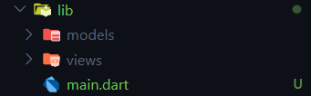

### Langkah 2

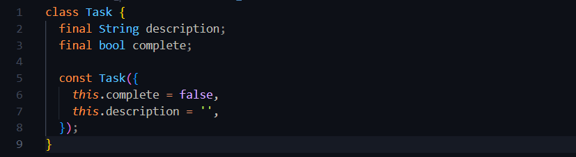

### Langkah 3

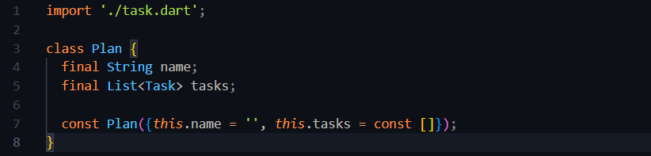

### Langkah 4

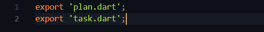

### Langkah 5

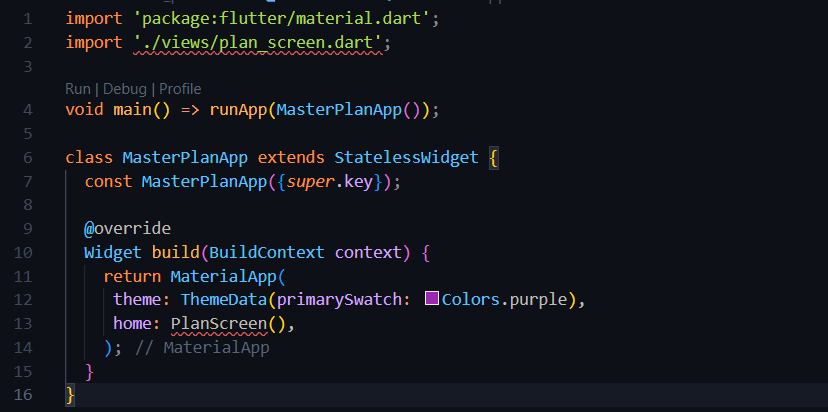

### Langkah 6

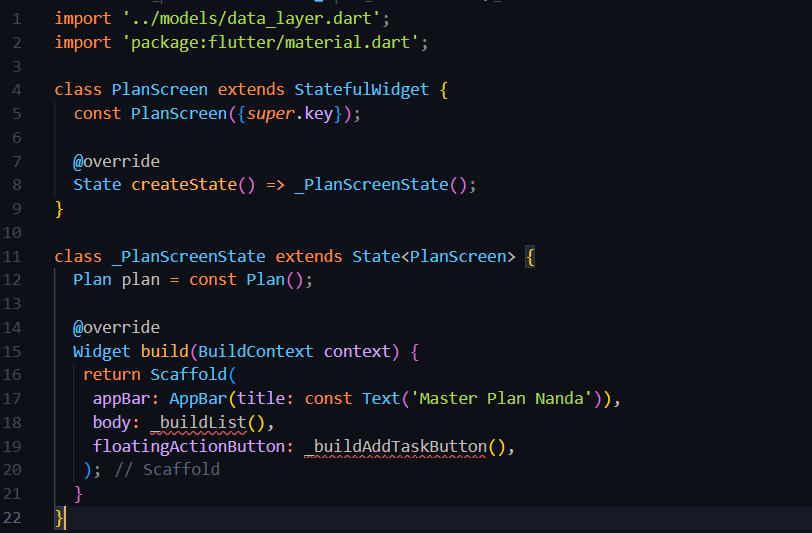

### Langkah 7

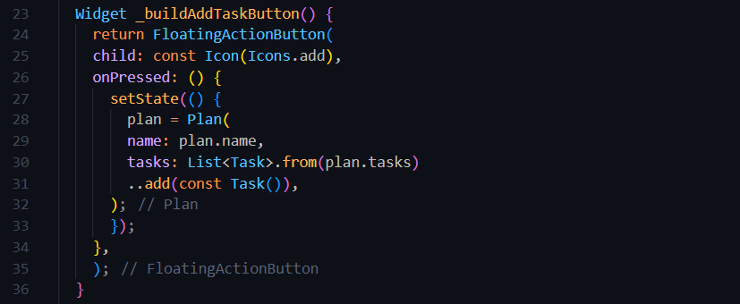

### Langkah 8

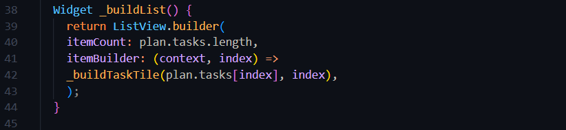

### Langkah 9

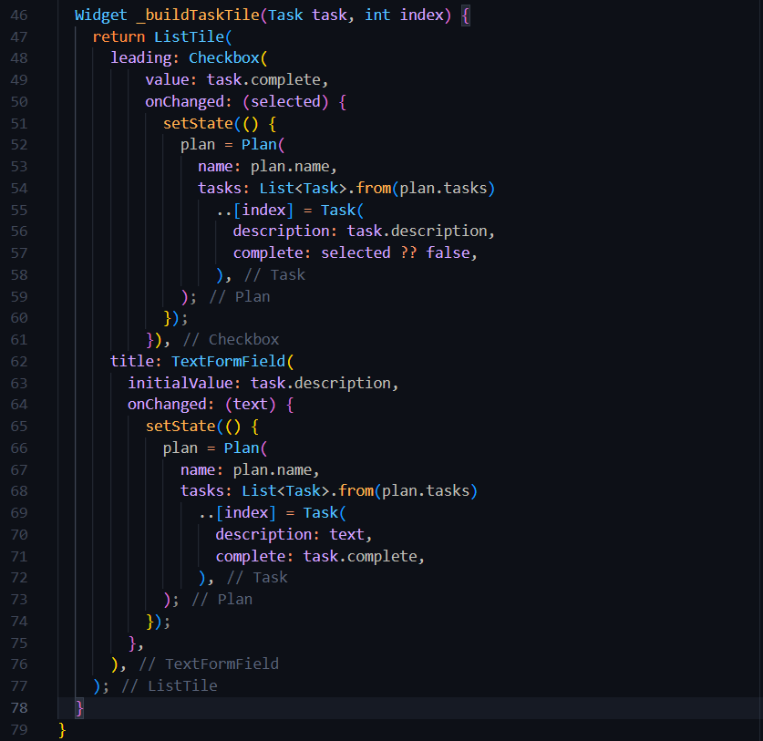

### Langkah 10

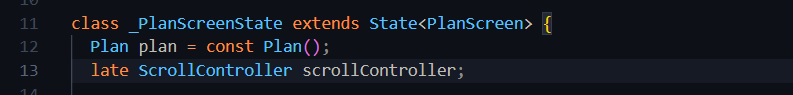

### Langkah 11

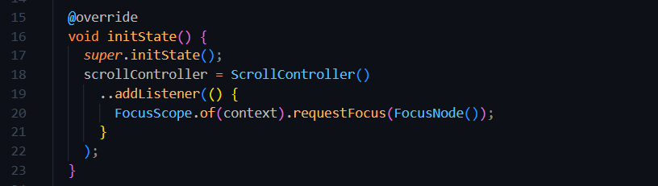

### Langkah 12

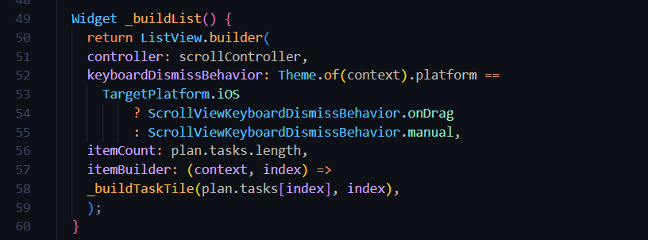

### Langkah 13

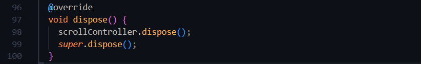

### Langkah 14

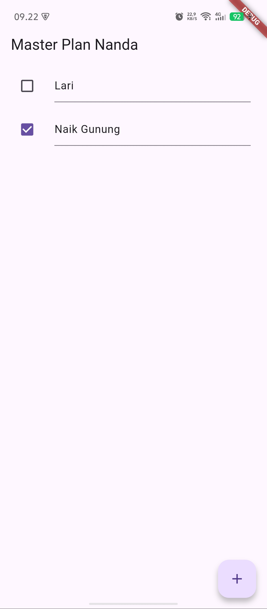

## Soal 2
**Jelaskan maksud dari langkah 4 pada praktikum tersebut! Mengapa dilakukan demikian?**

Pada langkah 4 bentujuan untuk menggabungkan file data layer seperti plan.dart dan task.dart didalam 1 file data_layer.dart yang kemudian di ekspor bersama, agar pas proses import di bagian lain aplikasi menjadi lebih sederhana dan efisien

## Soal 3
**Mengapa perlu variabel plan di langkah 6 pada praktikum tersebut? Mengapa dibuat konstanta ?**

Variabel plan pada langkah 6 adalah objek yang mewakili data (Plan) di halaman tersebut. Dibuatnya sebagai const agar nilainya tetap tidak berubah selama widget berjalan dan lebih hemat memori, terutama jika data Plan bersifat statis atau belum ada data dinamis.

## Soal 4
**Lakukan capture hasil dari Langkah 9 berupa GIF, kemudian jelaskan apa yang telah Anda buat!**

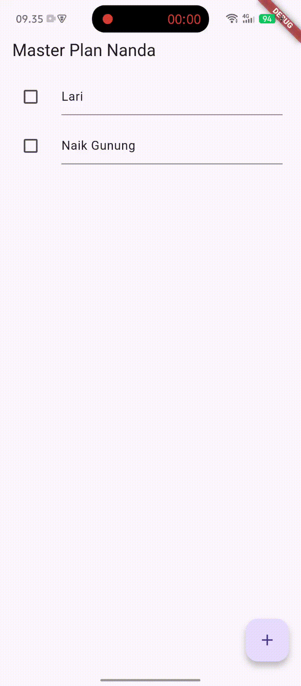

Pada langkah 9, saya membuat widget _buildTaskTile yang menampilkan setiap tugas dengan checkbox untuk menandai status selesai dan kolom teks untuk mengedit deskripsi. Setiap perubahan akan otomatis diperbarui melalui setState, membuat aplikasi lebih interaktif dan mudah digunakan.

## Soal 5
**Apa kegunaan method pada Langkah 11 dan 13 dalam lifecyle state ?**

Method initState pada langkah 11 digunakan untuk inisialisasi awal saat widget dibuat, seperti mendaftarkan listener pada scrollController

Sedangkan Method dispose pada langkah 13 digunakan untuk membersihkan resource dengan membuang scrollController saat widget tidak dipakai, mencegah memori terbuang sia-sia. 

Kedua method ini penting untuk mengelola resource widget secara efisien dan aman.

## Soal 6
**Kumpulkan laporan praktikum Anda berupa link commit atau repository GitHub ke dosen yang telah disepakati !**

---
# Tugas Praktikum 10 - 2: Mengelola Data Layer dengan InheritedWidget dan InheritedNotifier

## Soal 1
Selesaikan langkah-langkah praktikum tersebut, lalu dokumentasikan berupa GIF hasil akhir praktikum beserta penjelasannya di file README.md! Jika Anda menemukan ada yang error atau tidak berjalan dengan baik, silakan diperbaiki sesuai dengan tujuan aplikasi tersebut dibuat.

### Langkah 1

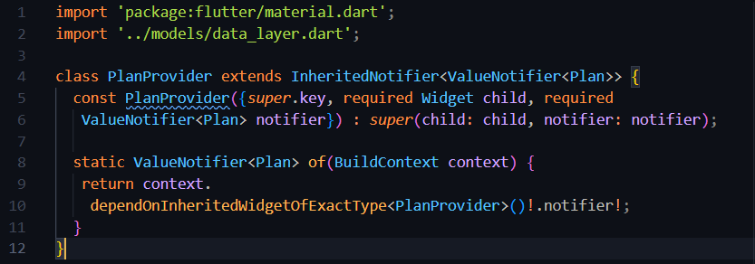

### Langkah 2

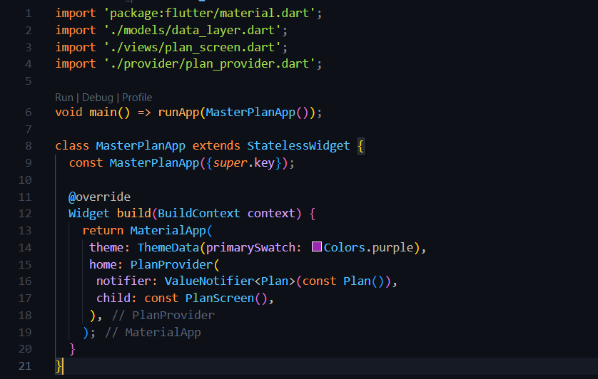

### Langkah 3

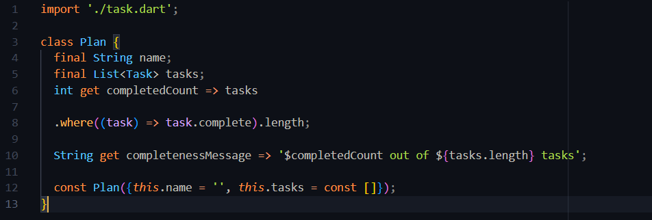

### Langkah 4

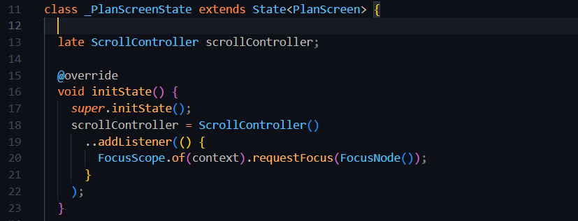

### Langkah 5

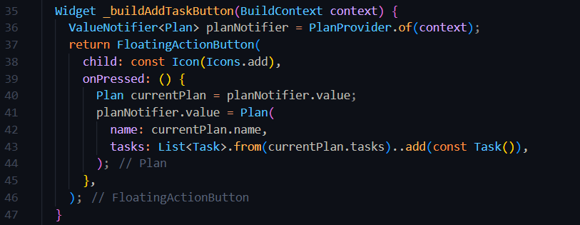

### Langkah 6

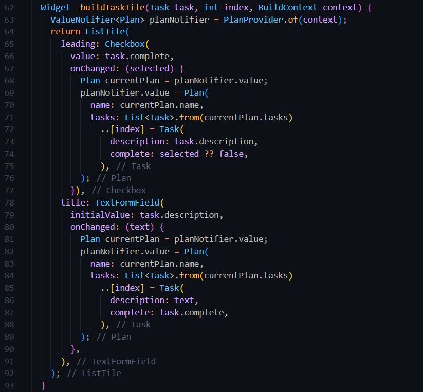

### Langkah 7

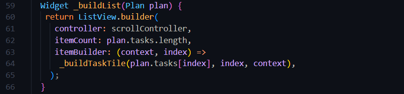

### Langkah 8 & 9

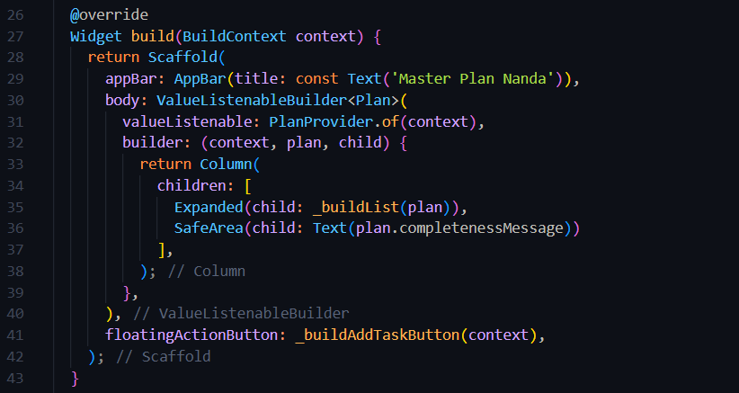

## Soal 2
**Jelaskan mana yang dimaksud InheritedWidget pada langkah 1 tersebut! Mengapa yang digunakan InheritedNotifier?**

InheritedWidget pada langkah 1 adalah class PlanProvider yang mewarisi InheritedNotifier dan digunakan InheritedNotifier karena dapat menurunkan data ke widget lain dan secara otomatis memberi tahu serta membangun ulang widget turunannya saat data pada ValueNotifier<Plan> berubah.

## Soal 3
**Jelaskan maksud dari method di langkah 3 pada praktikum tersebut! Mengapa dilakukan demikian?**

Method pada langkah 3 digunakan untuk menghitung jumlah task yang selesai (completedCount) dan membuat pesan rekap progres tugas (completenessMessage), Ini memudahkan menampilkan data ringkasan tugas secara otomatis, sehingga antarmuka aplikasi dapat langsung menampilkan informasi progres tanpa perlu logika tambahan.

## Soal 4
**Lakukan capture hasil dari Langkah 9 berupa GIF, kemudian jelaskan apa yang telah Anda buat!**

### Hasil

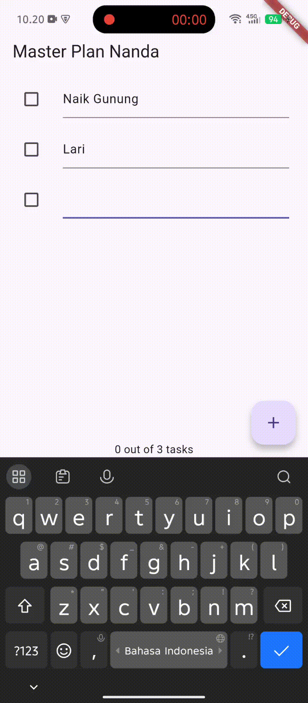

Pada langkah ini menambahkan widget SafeArea yang menampilkan pesan progress tugas (completenessMessage) di bagian bawah layar. SafeArea memastikan pesan tidak tertutup oleh notch atau elemen sistem. Hasilnya setiap kali pengguna menambah atau menyelesaikan tugas, informasi progres langsung tampil dengan jelas, memudahkan pengguna memantau pekerjaan secara real-time.

## Soal 5
**Kumpulkan laporan praktikum Anda berupa link commit atau repository GitHub ke dosen yang telah disepakati !**

---
# Tugas Praktikum 10 - 3: Membuat State di Multiple Screens

## Soal 1
Selesaikan langkah-langkah praktikum tersebut, lalu dokumentasikan berupa GIF hasil akhir praktikum beserta penjelasannya di file README.md! Jika Anda menemukan ada yang error atau tidak berjalan dengan baik, silakan diperbaiki sesuai dengan tujuan aplikasi tersebut dibuat.

### Langkah 1

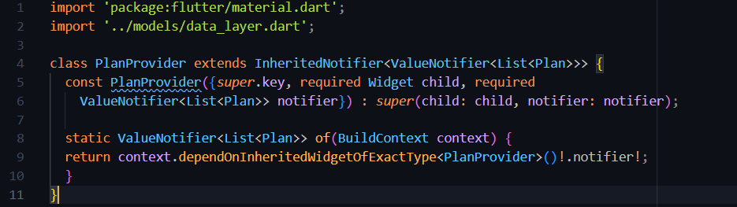

### Langkah 2

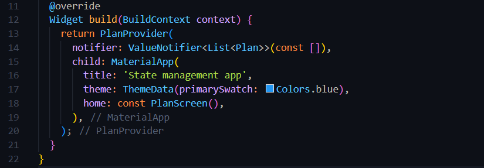

### Langkah 3

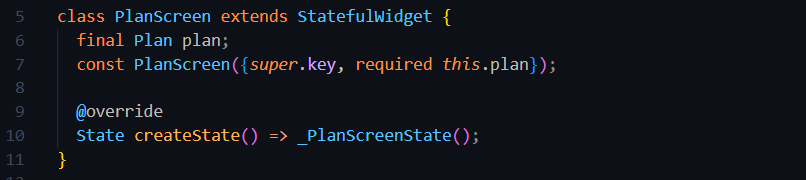

### Langkah 4, 5, 6

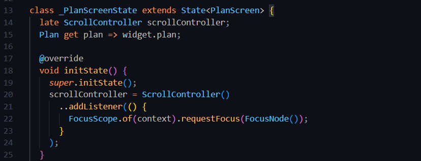

### Langkah 7

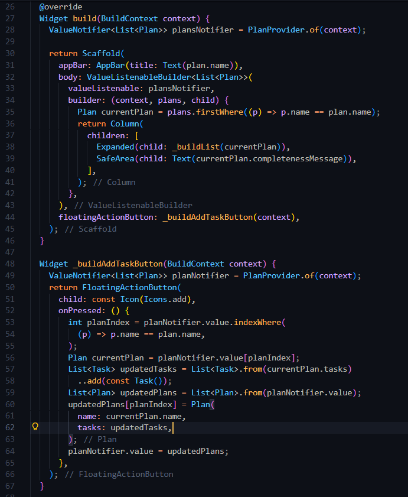

### Langkah 8

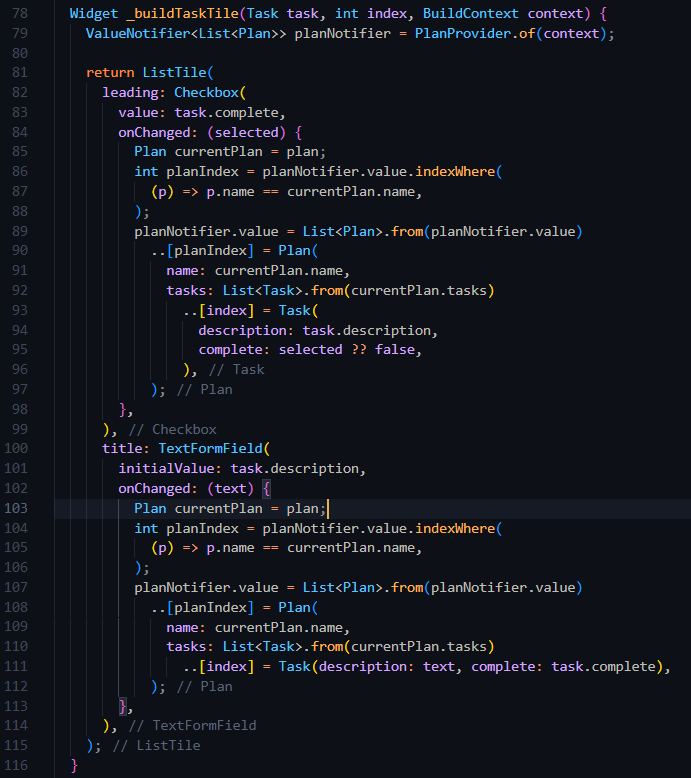

### Langkah 9

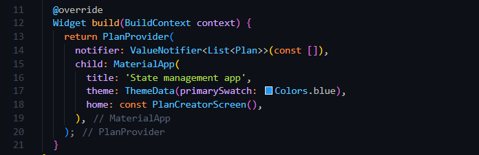

### Langkah 10 & 11

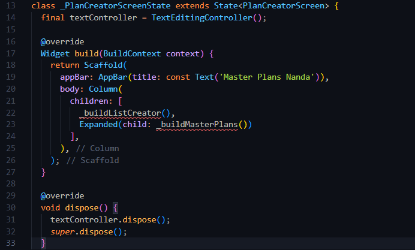

### Langkah 12

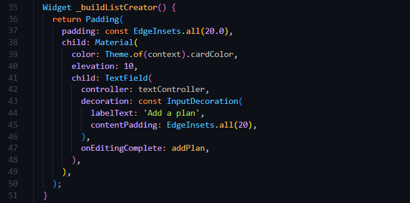

### Langkah 13

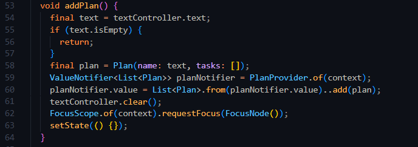

### Langkah 14

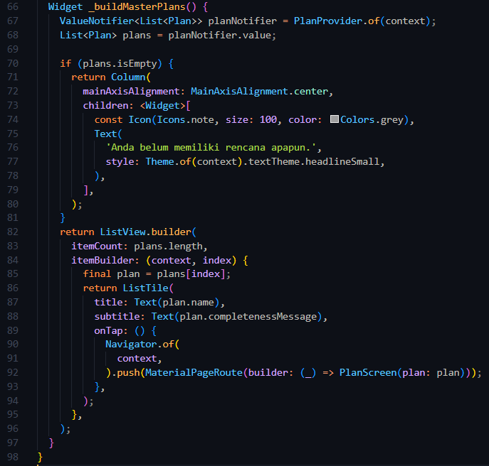

## Soal 2
Berdasarkan Praktikum 3 yang telah Anda lakukan, jelaskan maksud dari gambar diagram berikut ini!

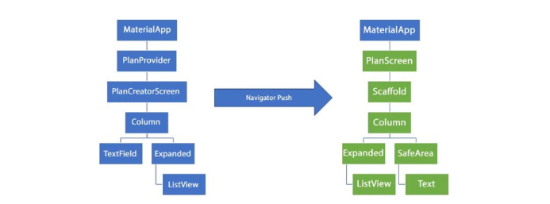

Diagram ini menjelaskan arsitektur State Management menggunakan InheritedNotifier dan Navigator untuk navigasi multi-screen dengan state yang terbagi.

Komponen Utama:

1. MaterialApp - Root widget yang membungkus seluruh aplikasi
2. PlanProvider - InheritedNotifier layer di level tertinggi yang menyediakan shared state ValueNotifier<List<Plan>> yang dapat diakses semua widget di bawahnya
3. Navigator - Mengelola stack navigasi antar screen (push/pop)
4. PlanCreatorScreen - Screen utama untuk membuat plan baru dan menampilkan list semua plan. Saat plan di-tap, navigasi ke PlanScreen menggunakan Navigator.push()
5. PlanScreen - Screen detail untuk mengelola tasks dari plan tertentu. Menerima object Plan dari navigasi dan memungkinkan pengguna check/uncheck task, edit deskripsi, atau tambah task baru

Kesimpulan: 

Diagram ini menerapkan pola "Lift State Up" dimana state di-naikkan ke level tertinggi (PlanProvider) agar bisa dibagi oleh multiple screens. Navigator mengelola perpindahan antar screen, sementara InheritedNotifier memastikan semua screen selalu memiliki data terkini tanpa perlu manual passing atau callback.

## Soal 3
Lakukan capture hasil dari Langkah 14 berupa GIF, kemudian jelaskan apa yang telah Anda buat!

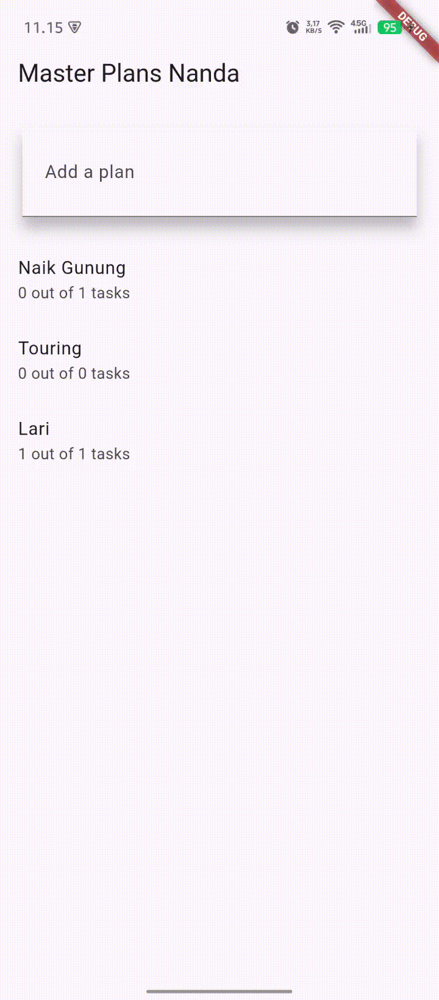

Pada langkah ini membuat halaman PlanCreatorScreen untuk membuat rencana baru. Pengguna dapat mengisi data plan menggunakan TextField dan melihat daftar input dengan ListView di dalam Column. 

Setelah plan dibuat, aplikasi navigasi ke PlanScreen menggunakan Navigator.push untuk menampilkan daftar tugas sesuai plan. Di PlanScreen, pesan progres (jumlah tugas selesai) ditampilkan dengan SafeArea agar aman dari notch. Ini melatih pembuatan tampilan dinamis, pengelolaan state, dan navigasi Flutter.

## Soal 4
Kumpulkan laporan praktikum Anda berupa link commit atau repository GitHub ke dosen yang telah disepakati !