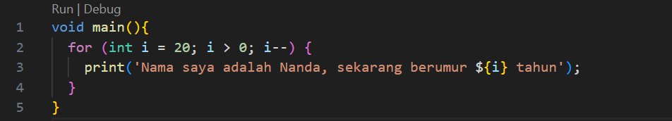
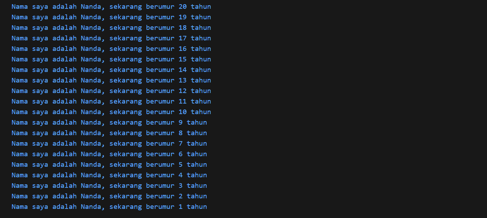
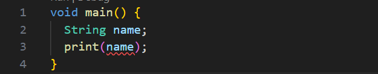
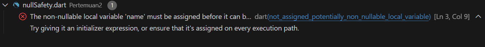
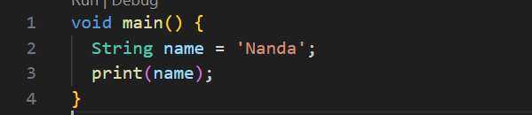
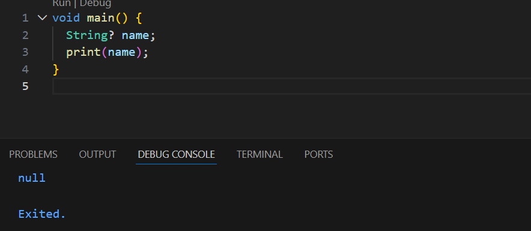
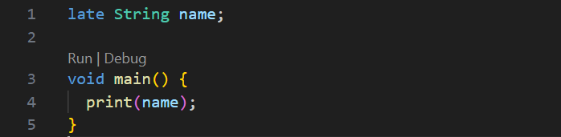
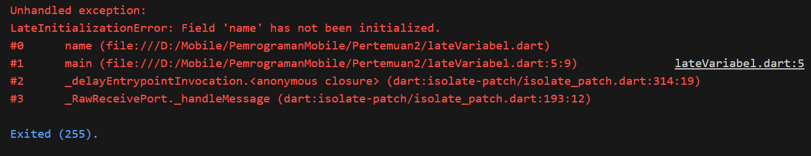
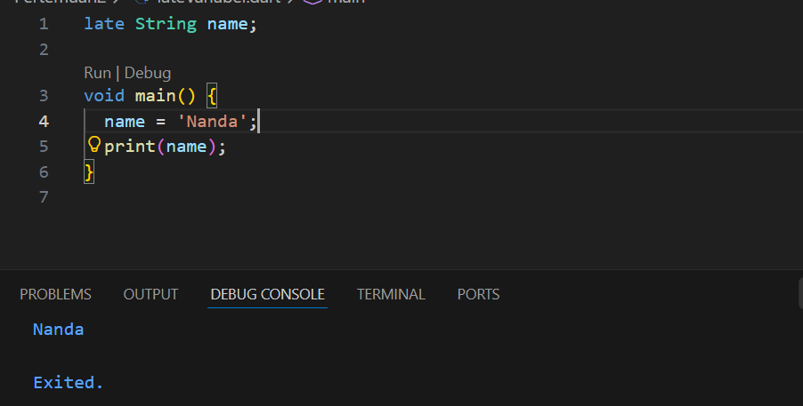

# Laporan Praktikum #02 - Pemrograman Dasar Dart - Bag.1 (Variabel dan Tipe Data)

## Identitas Mahasiswa

| Atribut | Nilai                        |
| ------- | -----                        |
| Nama    | Nanda Ricco Satria Indrawan  |
| NIM     | 244107060058                 |
| Kelas   | SIB-2D                       |
---

## Tugas Praktikum 2

### Soal 1

Modifikasilah kode pada baris 3 di VS Code atau Editor Code favorit Anda berikut ini agar mendapatkan keluaran (output) sesuai yang diminta!

```dart
void main() {
  for (int i = 0; i < 10; i++) {
    print("Hello ${i + 2}");
  }
}
```

**Jawab:**





---

### Soal 2

Mengapa sangat penting untuk memahami bahasa pemrograman Dart sebelum kita menggunakan framework Flutter? Jelaskan!

**Jawab:**

Memahami bahasa pemrograman Dart sangat penting sebelum menggunakan Flutter karena seluruh aplikasi Flutter ditulis menggunakan Dart. Dengan menguasai Dart, kita dapat memahami cara kerja dan struktur kode Flutter, sehingga proses pembuatan serta pengembangan aplikasi menjadi lebih mudah dan efisien.

---

### Soal 3

Rangkumlah materi dari codelab ini menjadi poin-poin penting yang dapat Anda gunakan untuk membantu proses pengembangan aplikasi mobile menggunakan framework Flutter.

**Jawab:**

1. Flutter memakai Dart sebagai bahasa utama untuk membangun tampilan (widget) dan logika aplikasi.
2. Dart menyediakan alat pengembangan yang lengkap, memiliki garbage collector, dan menjaga kode tetap aman lewat type safety.
3. Dart bersifat statically typed dan mendukung type inference
4. Dart dapat dikompilasi menggunakan 
    - Dart Virtual Machine (VM)
    - kompilasi ke JavaScript (dart2js)
5. Dart mendukung mode kompilasi yaitu
    - JIT (untuk pengembangan & hot reload)
    - AOT (untuk performa saat rilis)
6. Hot reload memungkinkan perubahan kode langsung terlihat tanpa restart aplikasi
7. Dart mendukung konsep OOP, class, object
8. Dart memiliki operator aritmatika, relasional, logika, serta increment/decrement

---

### Soal 4

Buatlah penjelasan dan contoh eksekusi kode tentang perbedaan Null Safety dan Late variabel!

**Jawab:**

#### Null Safety

Null Safety adalah fitur Dart yang mencegah variabel bernilai null secara tidak sengaja, sehingga mengurangi error saat program berjalan (runtime error).

Contohnya



Kenapa error? karena variabel name belum ada nilainya

Solusinya yaitu kita bisa mengisi variable tersebut seperti ini


atau bisa juga dengan menambahkan "?" jadi nanti outputnya akan null


#### Late Variabel

Late variable digunakan untuk menunda pengisian nilai variabel. Dengan late, programmer berjanji bahwa variabel akan diisi sebelum digunakan. Jika tidak, program akan mengalami error saat dijalankan.

Contohnya



walaupun codenya tidak error, pada saat kita run akan muncul error "LateInitializationError" karena kita belum mengisi variable namenya

Solusinya yaitu mengisi variabel name seperti berikut


Jadi kesimpulannya adalah
Null Safety digunakan untuk variabel yang boleh bernilai null, sedangkan late digunakan untuk variabel yang tidak boleh null tetapi diisi belakangan, dengan syarat harus diinisialisasi sebelum digunakan agar tidak terjadi error.
