# Laporan Praktikum #03 | Pengantar Bahasa Pemrograman Dart - Bagian 2

## Identitas Mahasiswa

| Atribut | Nilai                        |
| ------- | -----                        |
| Nama    | Nanda Ricco Satria Indrawan  |
| NIM     | 244107060058                 |
| Kelas   | SIB-2D                       |
---

## Tugas Praktikum 3

## Praktikum 1
### Langkah 1:

Ketik atau salin kode program berikut ke dalam fungsi `main()`.

```dart
String test = "test2";
if (test == "test1") {
   print("Test1");
} else If (test == "test2") {
   print("Test2");
} Else {
   print("Something else");
}

if (test == "test2") print("Test2 again");
```

### Langkah 2:

Silakan coba eksekusi (Run) kode pada langkah 1 tersebut. Apa yang terjadi? Jelaskan!

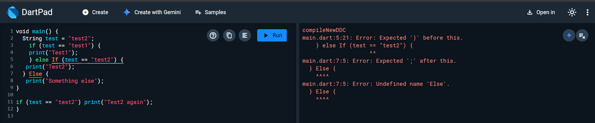

Terjadi error karena pada baris 5 penulisan 'If' menggunakan huruf 'I' kapital, dan pada baris 7 penulisan 'Else' menggunakan huruf 'E' kapital. Seharusnya, penulisan 'if' maupun 'else' menggunakan huruf kecil di awalnya agar tidak terjadi error

### Langkah 3:

Tambahkan kode program berikut, lalu coba eksekusi (Run) kode Anda.

```dart
String test = "true";
if (test) {
   print("Kebenaran");
}
```

Apa yang terjadi ? Jika terjadi error, silakan perbaiki namun tetap menggunakan if/else

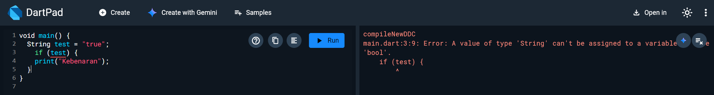

Terjadi error karena variabel test bertipe String bukan boolean. Pada Dart kondisi pada if harus berupa nilai boolean (true atau false), jadi String tidak bisa langsung digunakan sebagai syarat if

Perbaikannya

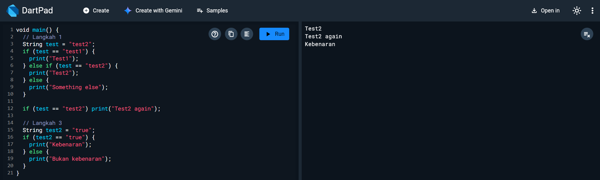

Maka akan muncul 'Kebenaran' sebagai output

## Praktikum 2
### Langkah 1:

Ketik atau salin kode program berikut ke dalam fungsi `main()`.

```dart
while (counter < 33) {
  print(counter);
  counter++;
}
```

### Langkah 2:

Silakan coba eksekusi (Run) kode pada langkah 1 tersebut. Apa yang terjadi? Jelaskan! Lalu perbaiki jika terjadi error.

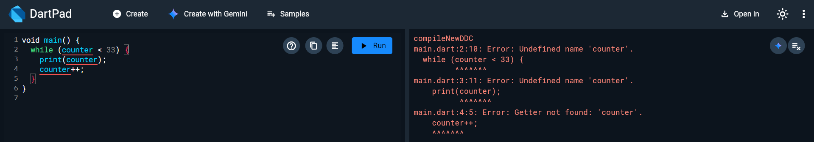

Terjadi error karena variabel counter belum dideklarasikan sebelum digunakan di dalam loop while

Perbaikannya yaitu dengan mendeklarasikan variabel counter terlebih dahulu dengan tipe data int dan memberikan nilai awal, contohnya yaitu int counter = 0;, agar program bisa berjalan tanpa error

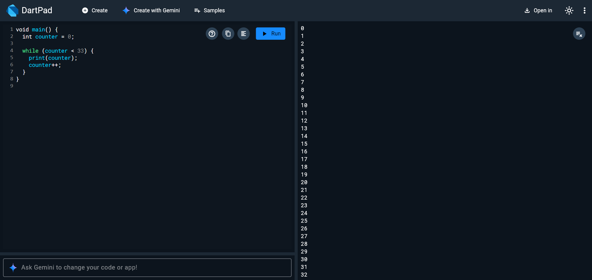

### Langkah 3:

Tambahkan kode program berikut, lalu coba eksekusi (Run) kode Anda.

```dart
do {
  print(counter);
  counter++;
} while (counter < 77);
```

Apa yang terjadi ? Jika terjadi error, silakan perbaiki namun tetap menggunakan *do-while*.

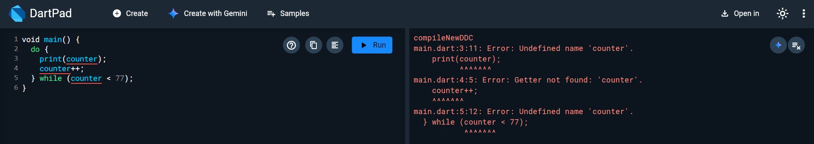

Errornya sama seperti sebelumnya yaitu variabel counter belum di deklarasikan

Perbaikannya sama seperti sebelumnya juga yaitu mendeklarasikan variabel counternya

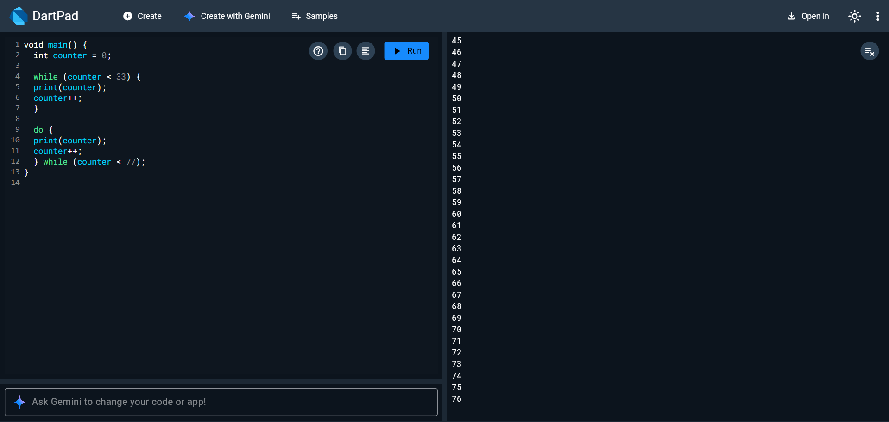

## Praktikum 3
### Langkah 1:

Ketik atau salin kode program berikut ke dalam fungsi `main()`.

```dart
for (Index = 10; index < 27; index) {
  print(Index);
}
```

### Langkah 2:

Silakan coba eksekusi (Run) kode pada langkah 1 tersebut. Apa yang terjadi? Jelaskan! Lalu perbaiki jika terjadi error.

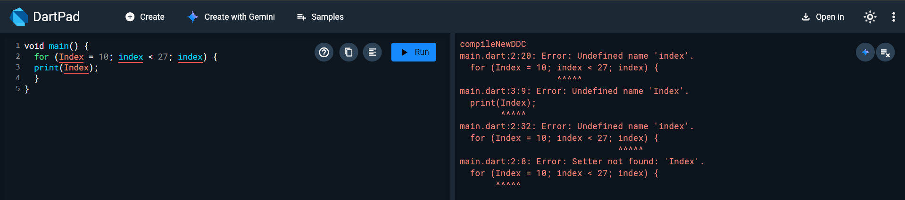

Terjadi error karena beberapa hal yaitu index belum memiliki tipe data, penulisannya yang seharusnya 'index' jadi 'Index', dan pada baris 2 index belum ditambahkan ++ di bagian akhirnya. 

Perbaikannya yaitu menambahkan tipe data pada index, mengganti penulisan 'Index' menjadi 'index', serta menambahkan ++ pada index di akhir baris 2.

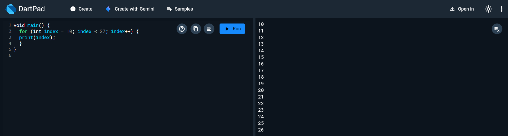

### Langkah 3:

Tambahkan kode program berikut di dalam *for-loop*, lalu coba eksekusi (Run) kode Anda.

```dart
If (Index == 21) break;
Else If (index > 1 || index < 7) continue;
print(index);
```

Apa yang terjadi ? Jika terjadi error, silakan perbaiki namun tetap menggunakan *for* dan *break-continue*.

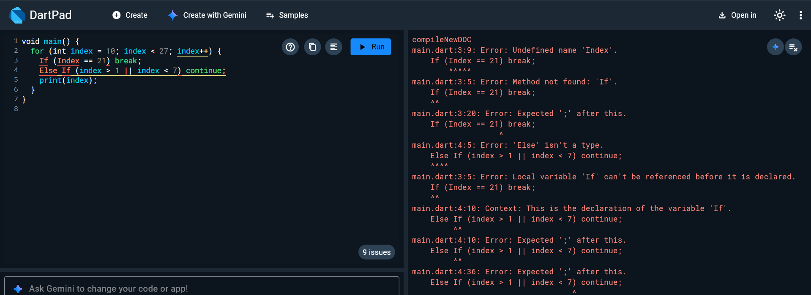

Terjadi error karena penulisan If dan Else If menggunakan huruf kapital, padahal Dart bersifat case-sensitive sehingga harus menggunakan huruf kecil ('if' dan 'else if'), terdapat warning karena pernyataan if dan else if tidak dibungkus dengan kurung kurawal {}, Selain itu penggunaan operator || membuat kondisi selalu TRUE karena index > 1 sudah pasti terpenuhi saat index dimulai dari 10, sehingga perintah print tidak pernah dijalankan

Perbaikannya yaitu mengubah penulisan If dan Else If menjadi if dan else if, serta mengganti operator || dengan && agar perintah print tetap berjalan dan menghasilkan output angka 10 sampai 20, lalu berhenti di index 21 karena adanya break

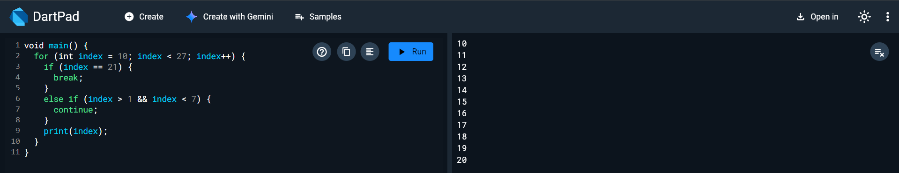