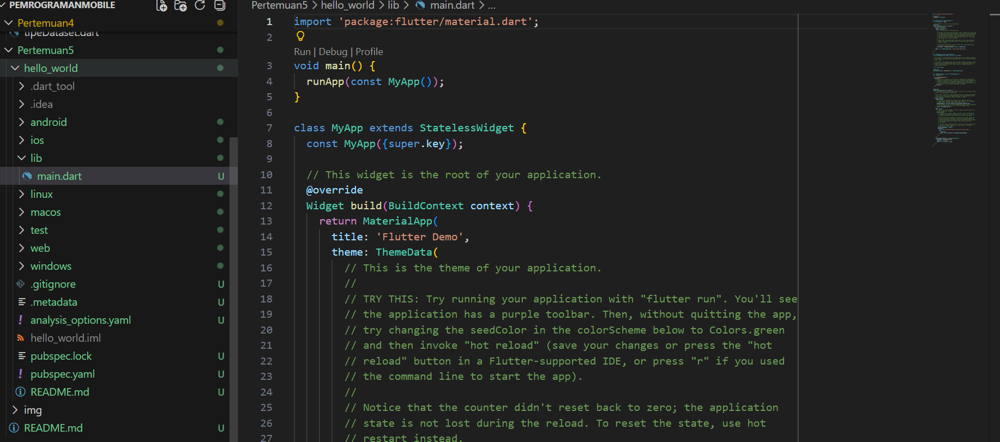
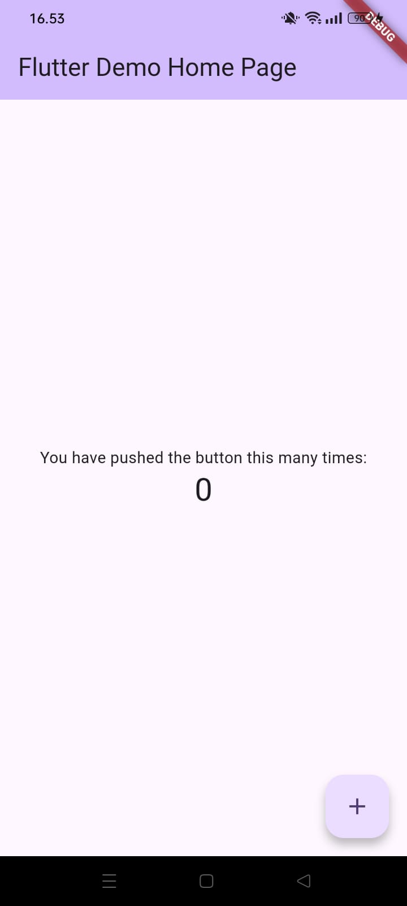
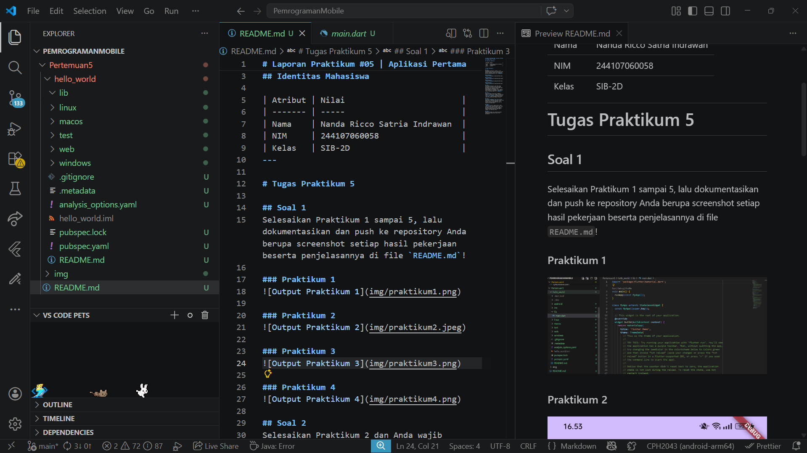

# Laporan Praktikum #05 | Aplikasi Pertama dan Widget Dasar Flutter

## Identitas Mahasiswa

| Atribut | Nilai                        |
| ------- | -----                        |
| Nama    | Nanda Ricco Satria Indrawan  |
| NIM     | 244107060058                 |
| Kelas   | SIB-2D                       |
---

# Tugas Praktikum 5

## Soal 1
Selesaikan Praktikum 1 sampai 5, lalu dokumentasikan dan push ke repository Anda berupa screenshot setiap hasil pekerjaan beserta penjelasannya di file `README.md`!

### Praktikum 1

### Praktikum 2

### Praktikum 3

### Praktikum 4

## Soal 2
Selesaikan Praktikum 2 dan Anda wajib menjalankan aplikasi hello_world pada perangkat fisik (device Android/iOS) agar Anda mempunyai pengalaman untuk menghubungkan ke perangkat fisik. Capture hasil aplikasi di perangkat, lalu buatlah laporan praktikum pada file `README.md`.

## Soal 3
Pada praktikum 5 mulai dari Langkah 3 sampai 6, buatlah file widget tersendiri di folder `basic_widgets`, kemudian pada file `main.dart` cukup melakukan import widget sesuai masing-masing langkah tersebut!

## Soal 4
Selesaikan [Codelabs: Your first Flutter app](https://codelabs.developers.google.com/codelabs/first-flutter-app-pt1), lalu buatlah laporan praktikumya dan push ke repository GitHub Anda!

## Soal 5
`README.md` berisi: capture hasil akhir tiap praktikum (*side-by-side*, bisa juga berupa file GIF agar terlihat proses perubahan ketika ada aksi dari pengguna) dengan menampilkan NIM dan Nama Anda sebagai ciri pekerjaan Anda.

## Soal 6
Kumpulkan berupa link repository/commit GitHub Anda kepada dosen yang telah disepakati!