# Laporan Praktikum #06 | Layout dan Navigasi

## Identitas Mahasiswa

| Atribut | Nilai                       |
| ------- | --------------------------- |
| Nama    | Nanda Ricco Satria Indrawan |
| NIM     | 244107060058                |
| Kelas   | SIB-2D                      |

---

---

# Tugas Praktikum 1

## Soal 1

Selesaikan Praktikum 1 sampai 4, lalu dokumentasikan dan push ke repository Anda berupa screenshot setiap hasil pekerjaan beserta penjelasannya di file README.md!

### PRAKTIKUM 1: Membangun Layout di Flutter

**Langkah 2**

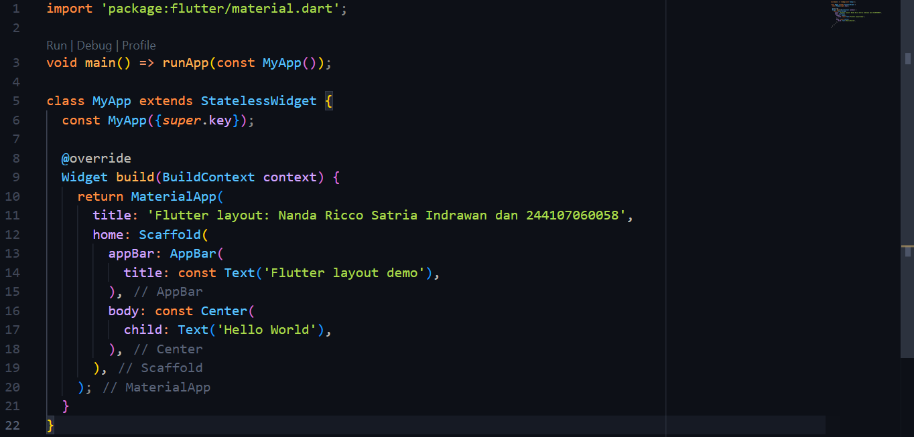

**Langkah 4**

- Soal 1


- Soal 2

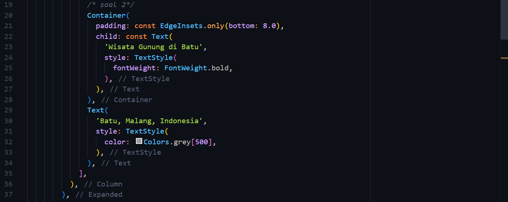

- Soal 3

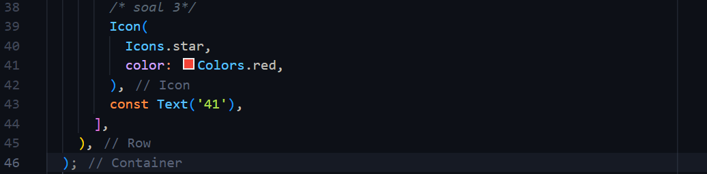

- Output

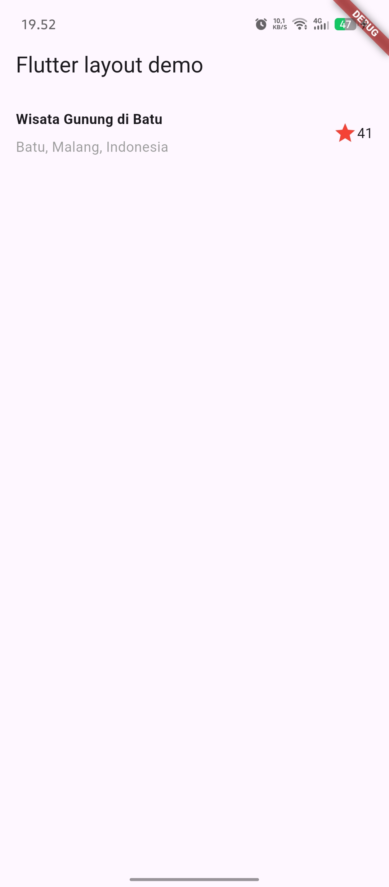

### PRAKTIKUM 2: Implementasi button row

- Output

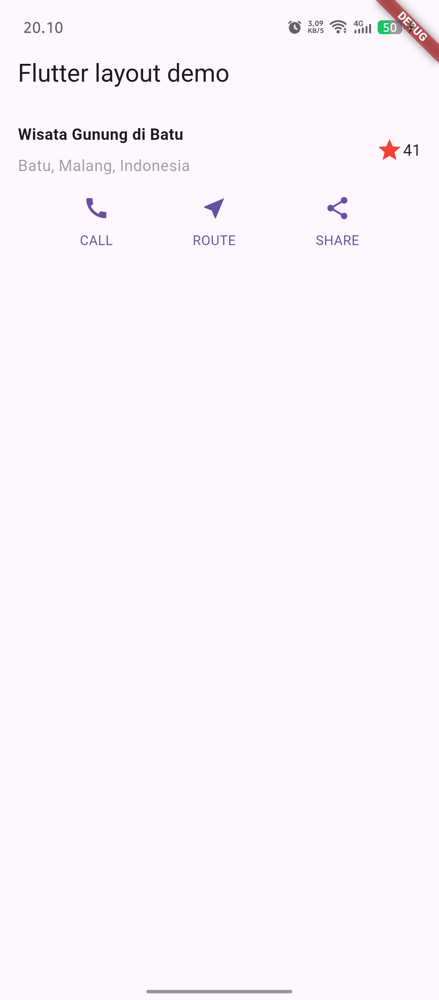

### PRAKTIKUM 3: Implementasi text section

- Output

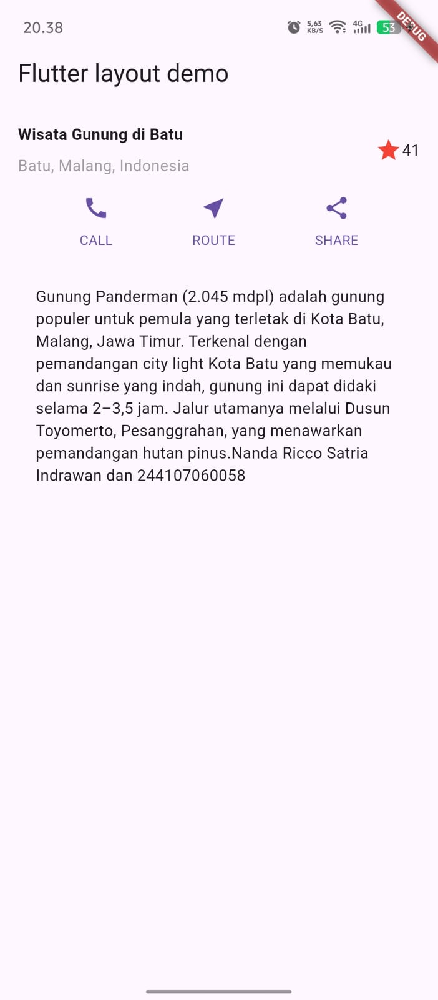

### PRAKTIKUM 4: Implementasi image section

- Output

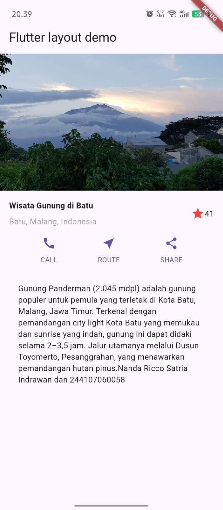

## Soal 2

Silakan implementasikan di project baru "basic_layout_flutter" dengan mengakses sumber ini: https://docs.flutter.dev/codelabs/layout-basics

**Menambahkan rekomendasi section**

```dart
Widget recommendationSection = Container(
    padding: const EdgeInsets.all(16),
    child: Column(
      crossAxisAlignment: CrossAxisAlignment.start,
      children: [
        const Text(
          'Rekomendasi Gunung Lain',
            style: TextStyle(fontSize: 20, fontWeight: FontWeight.bold),
          ),
          const SizedBox(height: 16),
          Row(
            crossAxisAlignment: CrossAxisAlignment.center,
            children: [
              Expanded(
                child: Container(
                  height: 120,
                  decoration: BoxDecoration(
                    borderRadius: BorderRadius.circular(8),
                  ),
                  child: ClipRRect(
                    borderRadius: BorderRadius.circular(8),
                    child: Image.asset('images/Gunung_bokong.jpeg', fit: BoxFit.cover),
                  ),
                ),
              ),
              const SizedBox(width: 8),
              Expanded(
                child: Container(
                  height: 120,
                  decoration: BoxDecoration(
                    borderRadius: BorderRadius.circular(8),
                  ),
                  child: ClipRRect(
                    borderRadius: BorderRadius.circular(8),
                    child: Image.asset('images/Gunung_buthak.jpg', fit: BoxFit.cover),
                  ),
                ),
              ),
              const SizedBox(width: 8),
              Expanded(
                child: Container(
                  height: 120,
                  decoration: BoxDecoration(
                    borderRadius: BorderRadius.circular(8),
                  ),
                  child: ClipRRect(
                    borderRadius: BorderRadius.circular(8),
                    child: Image.asset('images/Gunung_budugasu.jpeg', fit: BoxFit.cover),
                  ),
                ),
              ),
            ],
          ),
        ],
      ),
    );
```

**Tambahkan juga di body**

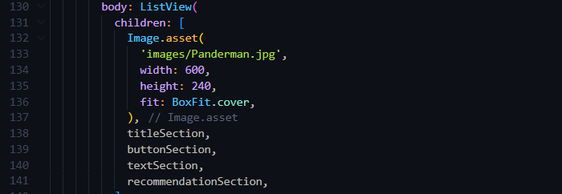

**Output**


## Soal 3

Kumpulkan link commit repository GitHub Anda kepada dosen yang telah disepakati!

# Praktikum 5: Membangun Navigasi di Flutter

- Langkah 1: Siapkan project baru

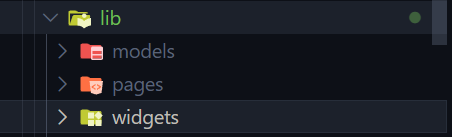

- Langkah 2: Mendefinisikan Route

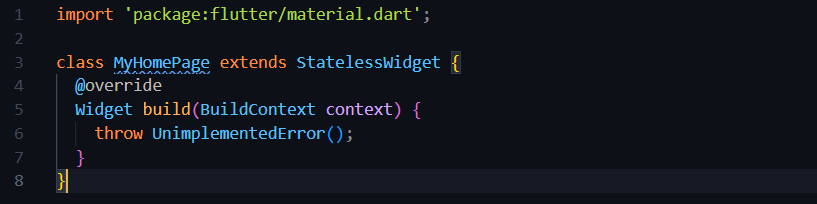
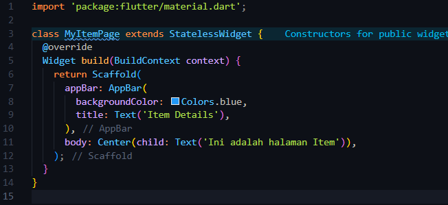

- Langkah 3: Lengkapi Kode di main.dart

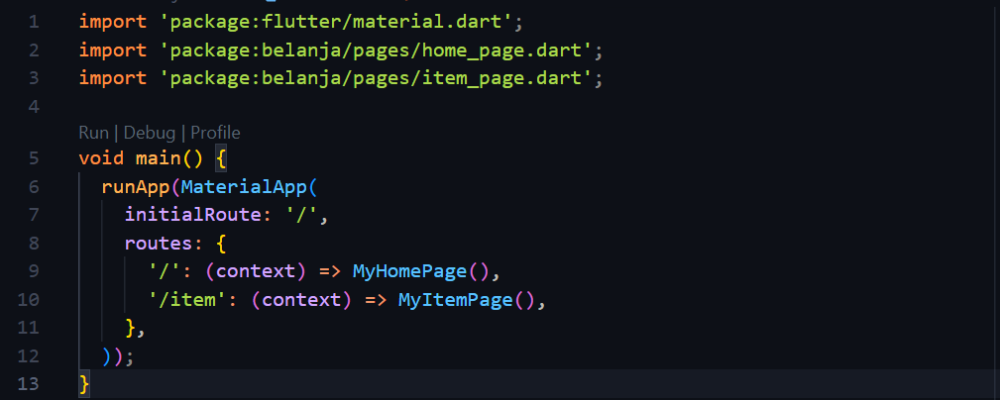

- Langkah 4: Membuat data model

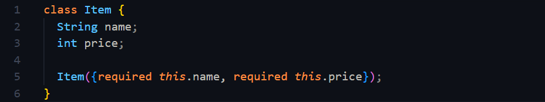

- Langkah 5: Lengkapi kode di class HomePage

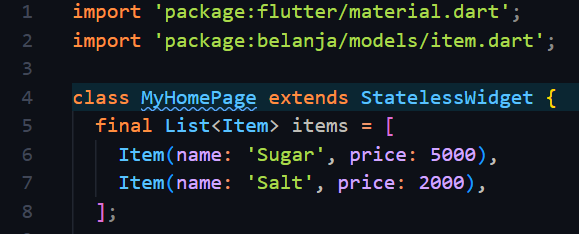

- Langkah 6: Membuat ListView dan itemBuilder

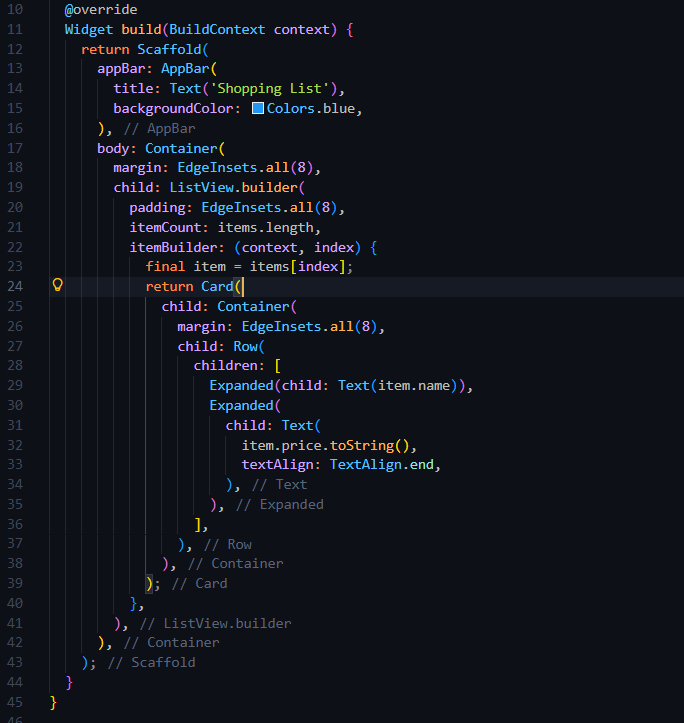
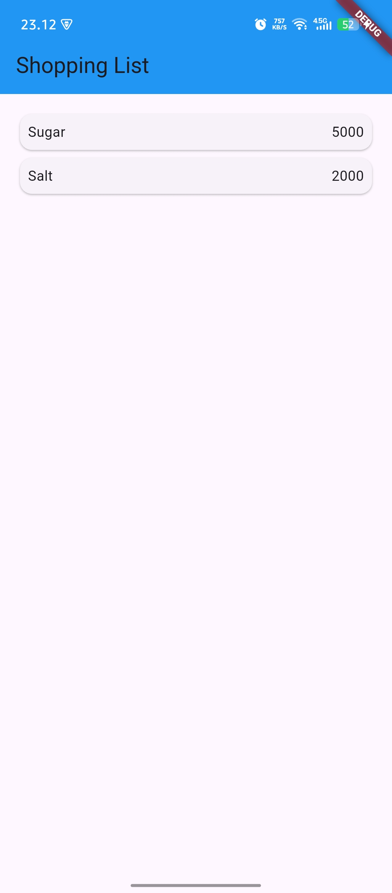

- Langkah 7: Menambahkan aksi pada ListView

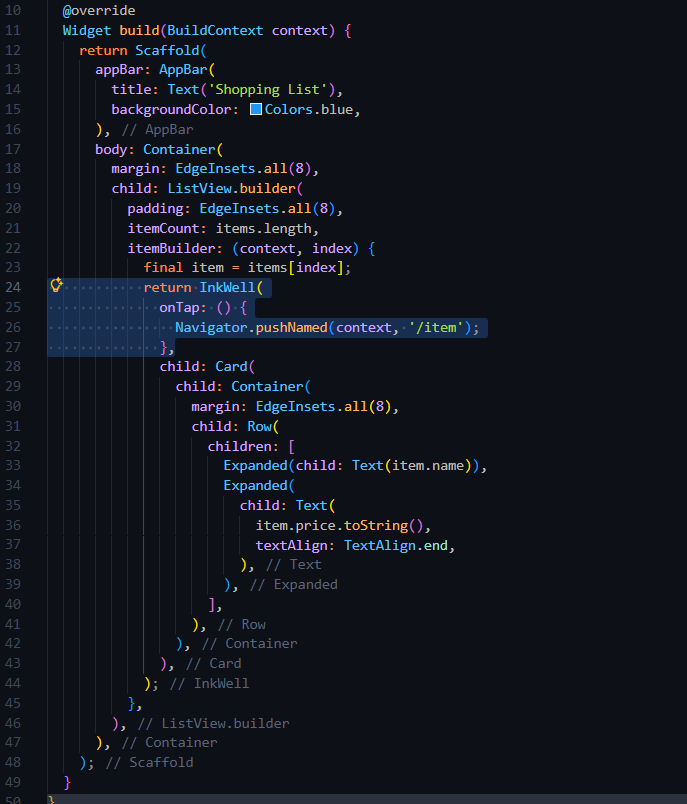
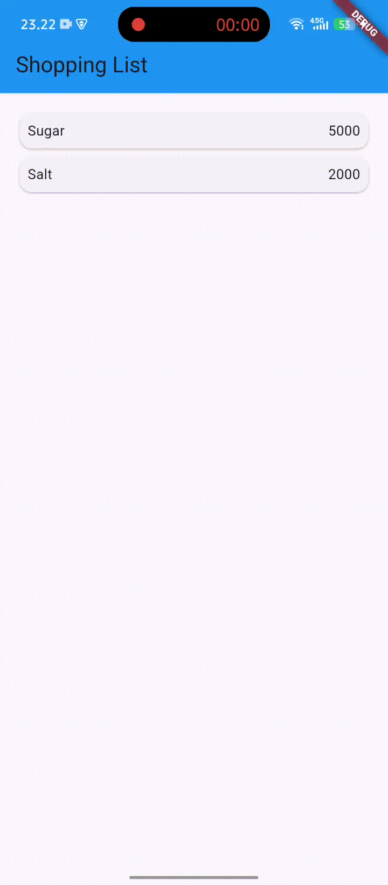

# Tugas Praktikum 2

## 1. Untuk melakukan pengiriman data ke halaman berikutnya, cukup menambahkan informasi arguments pada penggunaan Navigator. Perbarui kode pada bagian Navigator menjadi seperti berikut.

```dart
Navigator.pushNamed(context, '/item', arguments: item);
```


## 2. Pembacaan nilai yang dikirimkan pada halaman sebelumnya dapat dilakukan menggunakan ModalRoute. Tambahkan kode berikut pada blok fungsi build dalam halaman ItemPage. Setelah nilai didapatkan, anda dapat menggunakannya seperti penggunaan variabel pada umumnya. (https://docs.flutter.dev/cookbook/navigation/navigate-with-arguments)

```dart
final itemArgs = ModalRoute.of(context)!.settings.arguments as Item;
```

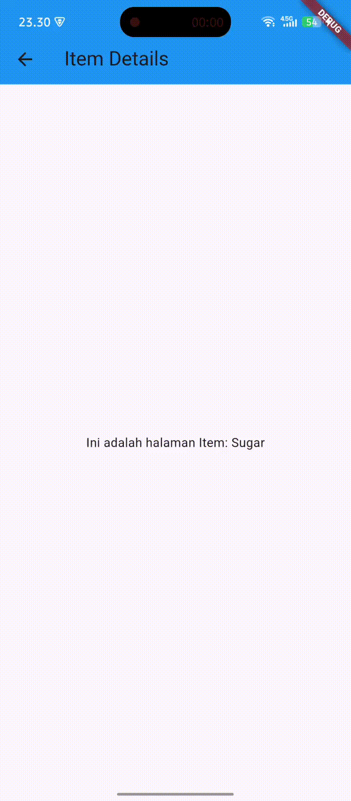

## 3. Pada hasil akhir dari aplikasi belanja yang telah anda selesaikan, tambahkan atribut foto produk, stok, dan rating. Ubahlah tampilan menjadi GridView seperti di aplikasi marketplace pada umumnya.

## 4. Silakan implementasikan Hero widget pada aplikasi belanja Anda dengan mempelajari dari sumber ini: https://docs.flutter.dev/cookbook/navigation/hero-animations

### Jawab 3 dan 4

- **Item Model dengan atribut Foto, Stok, dan Rating**

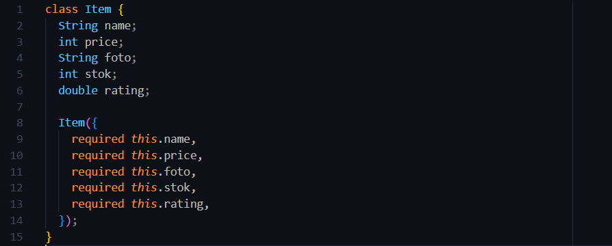

- **GridView Implementation pada HomePage**

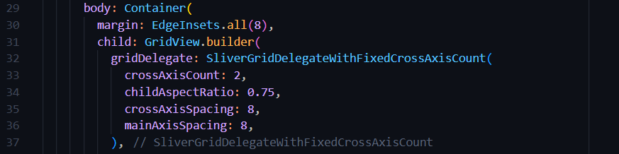

- **Data Items dengan Semua Atribut pada HomePage**

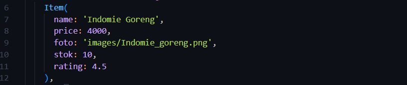

- **Card Layout dengan Hero Animation (GridView Items)**

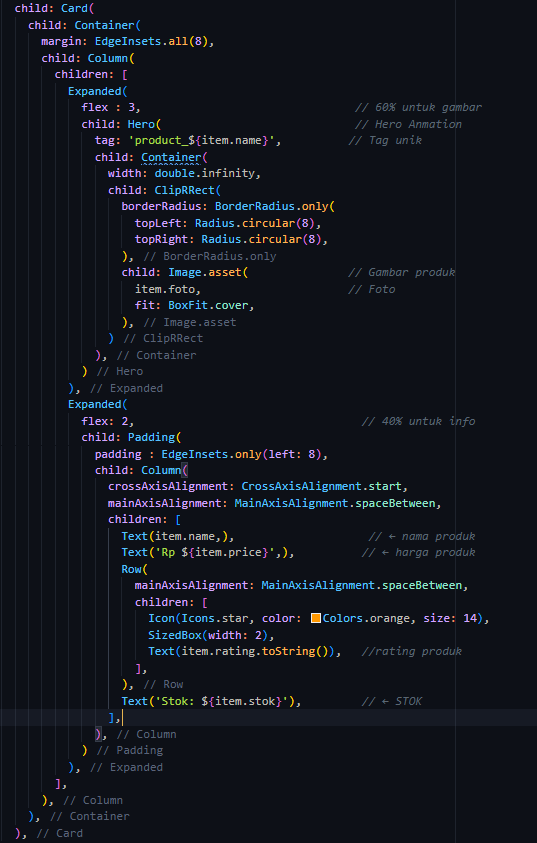

- **Hero Animation pada ItemPage**

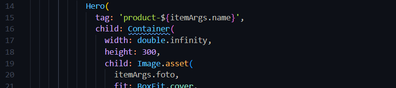

- **Display Informasi Lengkap di ItemPage**

```dart
            Padding(
              padding: EdgeInsets.all(16),
              child: Column(
                crossAxisAlignment: CrossAxisAlignment.start,
                children: [
                  Text(
                    itemArgs.name,
                    style: TextStyle(fontSize: 24, fontWeight: FontWeight.bold),
                  ),
                  SizedBox(height: 8),
                  Text(
                    'Rp ${itemArgs.price.toString()}',
                    style: TextStyle(
                      fontSize: 20,
                      color: Colors.green[700],
                      fontWeight: FontWeight.w600,
                    ),
                  ),
                  SizedBox(height: 16),
                  Row(
                    children: [
                      Icon(Icons.star, color: Colors.orange, size: 20),
                      SizedBox(width: 4),
                      Text(
                        itemArgs.rating.toString(),
                        style: TextStyle(
                          fontSize: 16,
                          fontWeight: FontWeight.w500,
                        ),
                      ),
                      SizedBox(width: 8),
                      Text(
                        '(${(itemArgs.rating * 100).toInt()} reviews)',
                        style: TextStyle(fontSize: 14, color: Colors.grey[600]),
                      ),
                    ],
                  ),
                  SizedBox(height: 16),
                  Container(
                    padding: EdgeInsets.symmetric(vertical: 8, horizontal: 12),
                    decoration: BoxDecoration(
                      color: itemArgs.stok > 0
                          ? Colors.green[50]
                          : Colors.red[50],
                      borderRadius: BorderRadius.circular(8),
                      border: Border.all(
                        color: itemArgs.stok > 0 ? Colors.green : Colors.red,
                        width: 1,
                      ),
                    ),
                    child: Row(
                      mainAxisSize: MainAxisSize.min,
                      children: [
                        Icon(
                          itemArgs.stok > 0 ? Icons.check_circle : Icons.error,
                          color: itemArgs.stok > 0 ? Colors.green : Colors.red,
                          size: 16,
                        ),
                        SizedBox(width: 4),
                        Text(
                          itemArgs.stok > 0
                              ? 'Stock: ${itemArgs.stok} items available'
                              : 'Out of stock',
                          style: TextStyle(
                            color: itemArgs.stok > 0
                                ? Colors.green[800]
                                : Colors.red[800],
                            fontWeight: FontWeight.w500,
                          ),
                        ),
                      ],
                    ),
                  ),
                  SizedBox(height: 24),
                  Text(
                    'Product Description',
                    style: TextStyle(fontSize: 18, fontWeight: FontWeight.bold),
                  ),
                  SizedBox(height: 8),
                  Text(
                    'Ini adalah produk ${itemArgs.name}. Terkenal dengan tekstur mi kenyal, bumbu gurih yang khas, serta variasi rasa nusantara dengan rating ${itemArgs.rating}.',
                    style: TextStyle(
                      fontSize: 14,
                      color: Colors.grey[700],
                      height: 1.5,
                    ),
                  ),
                ],
              ),
            ),
```
- **Outputnya**


## 5. Sesuaikan dan modifikasi tampilan sehingga menjadi aplikasi yang menarik. Selain itu, pecah widget menjadi kode yang lebih kecil. Tambahkan Nama dan NIM di footer aplikasi belanja Anda.

- **Ubah app bar pada home page**

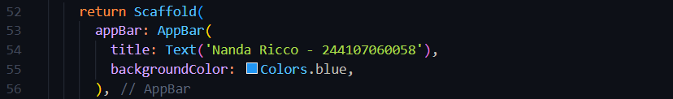

- **Outputnya**

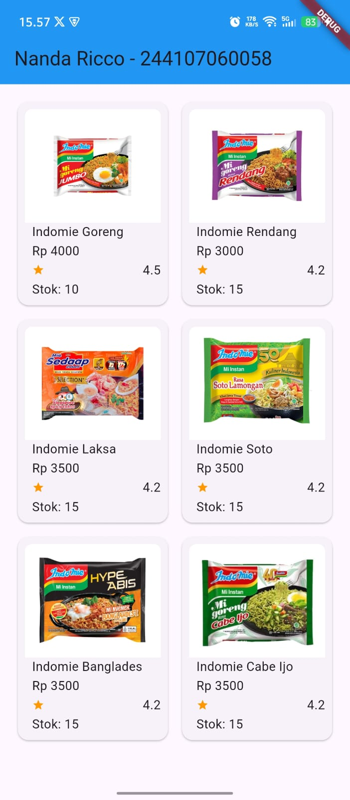

## 6. Selesaikan Praktikum 5: Navigasi dan Rute tersebut. Cobalah modifikasi menggunakan plugin go_router, lalu dokumentasikan dan push ke repository Anda berupa screenshot setiap hasil pekerjaan beserta penjelasannya di file README.md. Kumpulkan link commit repository GitHub Anda kepada dosen yang telah disepakati!

- **Tambahkan code ini di yaml**
``` dart
go_router: ^14.2.7
```

- **Lakukan pub get agar bisa digunakan**

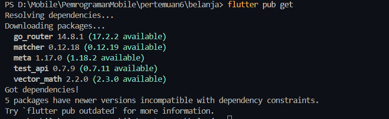

- **Konfigurasi go_router di dalam lib/router/go_router.dart**
``` dart
import 'package:flutter/material.dart';
import 'package:belanja/pages/home_page.dart';
import 'package:belanja/pages/item_page.dart';
import 'package:go_router/go_router.dart';                            // Import GoRouter package
import 'package:belanja/models/item.dart';

class AppRouter {
  static final _router = GoRouter(                                   // Konfigurasi GoRouter
    initialLocation: '/',                                           // Route awal  
    routes: [
      //HomePage route
      GoRoute(                                                      // Definisi untuk HomePage
        path: '/',                                                  // Path untuk HomePage
        builder: (context, state) => MyHomePage()),                 // Builder untuk HomePage                       
      
      //ItemPage route
      GoRoute(                                                      // Definisi untuk ItemPage
        path: '/item',                                              // Path sederhana untuk ItemPage
        builder: (context, state) {
          final item = state.extra as Item;                         // Mengambil data Item dari state.extra
          return MyItemPage(item: item);                            // Passing data Item ke ItemPage
        },
      ),
    ],
    // Error handling
    errorBuilder: (context, state) => Scaffold(                     // Error Handling
      body: Center(
        child: Column(
          mainAxisAlignment: MainAxisAlignment.center,
          children: [
            Icon(Icons.error_outline, size: 64, color: Colors.red),
            SizedBox(height: 16),
            Text(
              'Page not found!',
              style: TextStyle(fontSize: 18, fontWeight: FontWeight.bold),
            ),
            SizedBox(height: 8),
            Text('Error: ${state.error}'),
            SizedBox(height: 16),
            ElevatedButton(
              onPressed: () => context.go('/'),                     // Navigasi kembali ke HomePage
              child: Text('Go Home'),
            ),
          ],
        ),
      ),
    ),
  );

  static GoRouter get router => _router;              // Getter untuk mengakses router di seluruh aplikasi
}
```

- **Main nya**
```dart
import 'package:flutter/material.dart';
import 'package:belanja/router/go_router.dart';   // Import go_router

void main() {
  runApp(MyApp());
}

class MyApp extends StatelessWidget {
  @override
  Widget build(BuildContext context) {
    return MaterialApp.router(              
      title: 'Belanja App - Go Router',
      debugShowCheckedModeBanner: false,
      routerConfig: AppRouter.router,       // konfigurasi router dari AppRouter
      theme: ThemeData(
        primarySwatch: Colors.blue,
        useMaterial3: true,
      ),
    );
  }
}
```

- **Navigasi di HomePage menggunakan context.push**

import go_router

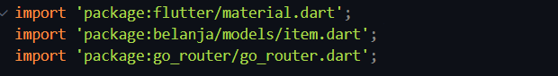

lalu ubah return InkWellnya

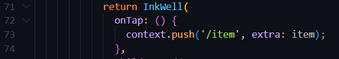

- **Hasilnya akan tetap sama**

