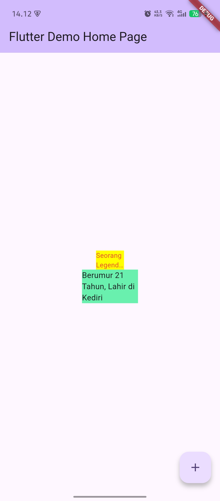

# Laporan Praktikum #07 | Manajemen Plugin

## Identitas Mahasiswa

| Atribut | Nilai                        |
| ------- | -----                        |
| Nama    | Nanda Ricco Satria Indrawan  |
| NIM     | 244107060058                 |
| Kelas   | SIB-2D                       |
---

# Tugas Praktikum 7

## Soal 1
Selesaikan Praktikum tersebut, lalu dokumentasikan dan push ke repository Anda berupa screenshot hasil pekerjaan beserta penjelasannya di file README.md!

**red_text_widget.dart**
``` dart
import 'package:flutter/material.dart';
import 'package:auto_size_text/auto_size_text.dart';

class RedTextWidget extends StatelessWidget {
  final String text;

  const RedTextWidget({Key? key, required this.text}) : super(key: key);
  
  @override
  Widget build(BuildContext context) {
    return AutoSizeText(
      text,
      style: const TextStyle(color: Colors.red, fontSize: 14),
      maxLines: 2,
      overflow: TextOverflow.ellipsis,
    );
  }
}
```
**main.dart**
``` dart
import 'package:flutter/material.dart';
import 'package:flutter_plugin_pubdev/red_text_widget.dart';

void main() {
  runApp(const MyApp());
}

class MyApp extends StatelessWidget {
  const MyApp({super.key});

  @override
  Widget build(BuildContext context) {
    return MaterialApp(
      title: 'Flutter Demo',
      theme: ThemeData(
        colorScheme: .fromSeed(seedColor: Colors.deepPurple),
      ),
      home: const MyHomePage(title: 'Flutter Demo Home Page'),
    );
  }
}

class MyHomePage extends StatefulWidget {
  const MyHomePage({super.key, required this.title});

  final String title;

  @override
  State<MyHomePage> createState() => _MyHomePageState();
}

class _MyHomePageState extends State<MyHomePage> {
  int _counter = 0;

  void _incrementCounter() {
    setState(() {
      _counter++;
    });
  }

  @override
  Widget build(BuildContext context) {
    return Scaffold(
      appBar: AppBar(
        backgroundColor: Theme.of(context).colorScheme.inversePrimary,
        title: Text(widget.title),
      ),
      body: Center(
        child: Column(
          mainAxisAlignment: MainAxisAlignment.center,
          children: <Widget>[
            Container(
              color: Colors.yellowAccent,
              width: 50,
              child: const RedTextWidget(
                text: 'Seorang Legendary Person and Fisher on Kediri City:',
              ),
            ),

            Container(
              color: Colors.greenAccent,
              width: 100,
              child: const Text(
                'Berumur 21 Tahun, Lahir di Kediri'
              ),
            )
          ],
        ),
      ),
      floatingActionButton: FloatingActionButton(
        onPressed: _incrementCounter,
        tooltip: 'Increment',
        child: const Icon(Icons.add),
      ),
    );
  }
}
```

**Output**


## Soal 2
Jelaskan maksud dari langkah 2 pada praktikum tersebut!
``` dart
flutter pub add auto_size_text
```
Command flutter di atas digunakan untuk menginstalasi atau menambahkan package auto_size_text ke dalam aplikasi Flutter, sehingga nantinya package ini dapat digunakan untuk menampilkan teks yang ukuran font-nya bisa menyesuaikan secara otomatis.

## Soal 3
Jelaskan maksud dari langkah 5 pada praktikum tersebut!
``` dart
final String text;

const RedTextWidget({Key? key, required this.text}) : super(key: key);
```
Kode diatas digunakan untuk mendefinisikan widget bernama RedTextWidget yang memiliki satu variabel text bertipe String yang nilainya tidak bisa diubah setelah dibuat (final), konstruktornya mengharuskan pengguna menyediakan nilai text saat membuat widget ini, sedangkan key bersifat opsional dan diteruskan ke class induknya.

## Soal 4
Pada langkah 6 terdapat dua widget yang ditambahkan, jelaskan fungsi dan perbedaannya!
``` dart
Container(
   color: Colors.yellowAccent,
   width: 50,
   child: const RedTextWidget(
             text: 'You have pushed the button this many times:',
          ),
),
Container(
    color: Colors.greenAccent,
    width: 100,
    child: const Text(
           'You have pushed the button this many times:',
          ),
),
```
Pada Container pertama memiliki backgroud kuning dengan lebar 50px dan menampilkan text berwarna merah karena menggunakan RedTextWidget sebagai childnya. RedTextWidget ini dilengkapi fitur auto-resize dari plugin AutoSizeText, sehingga teks otomatis menyesuaikan ukurannya agar muat dalam ruang yang ada, maksimal 2 baris dan akan terpotong dengan tanda "..." jika terlalu panjang

Sedangkan pada Container kedua memiliki background hijau dengan lebar 100px dan menampilkan teks menggunakan widget Text biasa tanpa fitur auto-resize dan warna teks default(hitam)

Perbedaan 2 Container tersebut adalah Container pertama memakai custom widget dengan fitur auto-resize, sedangkan Container kedua pakai widget bawaan yang tidak memiliki fitur auto-resize.

## Soal 5
Jelaskan maksud dari tiap parameter yang ada di dalam plugin auto_size_text berdasarkan tautan pada dokumentasi ini!

Berdasarkan dokumentasi resmi auto_size_text di pub.dev, berikut adalah penjelasan parameter-parameter utama yang tersedia:
- **text**: Parameter wajib yang berisi teks yang akan ditampilkan dan secara otomatis akan disesuaikan ukurannya.
- **style**: Untuk mengatur gaya tampilan teks, seperti warna, ukuran huruf, jenis font, dan lainnya.
- **maxLines**: Untuk menentukan jumlah maksimal baris teks yang dapat ditampilkan. Jika lebih dari nilai ini maka teks akan dipotong atau diberi elipsis (...).
- **minFontSize**: Untuk ukuran font minimum yang bisa digunakan ketika teks secara otomatis diperkecil agar muat dalam kotak.
- **maxFontSize**: Untuk ukuran font maximal yang bisa digunakan ketika teks secara otomatis diperkecil agar muat dalam kotak.
- **stepGranularity**: Untuk mengatur seberapa besar perubahan ukuran font saat menyesuaikan diri. Semakin kecil nilainya, semakin halus perubahannya, tapi proses kalkulasinya jadi lebih berat.
- **presetFontSizes**: Untuk membuat daftar ukuran font yang telah ditentukan, widget akan mencoba menggunakan ukuran-ukuran dalam daftar tersebut agar teks dapat dimuat dengan baik.
- **group**: Untuk mengelompokkan beberapa AutoSizeText agar mempunyai ukuran font yang sama (Untuk hasil layout yang konsisten).
- **textAlign**: Untuk mengatur perataan teks (kiri, kanan, tengah, justify, dll.).
- **textDirection**: Untuk mengatur arah teks, misalnya dari kiri ke kanan (LTR) atau kanan ke kiri (RTL).
- **overflow**: Untuk menentukan bagaimana teks yang tidak muat akan ditampilkan, misalnya dipotong, diberi titik-titik, dan lainnya.
- **softWrap**: Untuk menentukan apakah teks diizinkan untuk pindah ke baris baru secara otomatis.

## Soal 6
Kumpulkan laporan praktikum Anda berupa link repository GitHub kepada dosen!